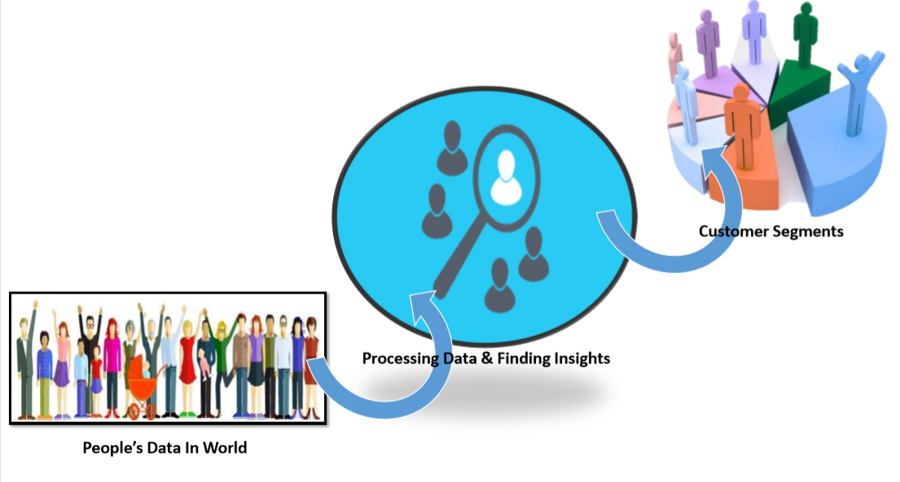

## Customer Segmentation Report for Arvato Financial Solutions

## Table of Contents

1. [Installation](#installation)
2. [Project Motivation](#motivation)
3. [Files Description](#files)
4. [Results](#results)
5. [Acknowledgements](#licensing)

## Installation 
The required libraries for running the code within Jupiter notebook & python files are part of the Anaconda distribution for Python 3.7.7
so We don't need to externally install them.
Following libraries were used:

* numpy
* pandas
* seaborn
* math
* random
* pickle
* sklearn
* matplotlib

** Keep  Updated the sklearn library **

## Project Motivation

The main goal of this project is to identifying the parts of the population that best describe the core customer base of the company and build a model that will be able to predict customers for Arvato Financial Solutions.

The project consists of 4 parts:

1. **`Data Preprocessing`** : In this section we preprocess the data for our further analysis. Missing values in columns & rows will be analysed & then data is divided by types followed by subsequent transformations.

2. **`Customer Segmentation`** : In this section we analyze General Population & Customer Segment data sets and use unsupervised learning techniques to perform customer segmentation, identifying the parts of the population that best describe the core customer base of the company. We will use Principal Component Analysis (PCA) technique for dimensionality reduction. Then, Elbow Curve will be used to identify the best number of clusters for KMeans algorithm. Finaly, we will apply KMeans to make segmentation of population and customers and determine description of target cluster for the company.

3. **`Supervised Learning Model`** : In this section we build machine learning model using response of marketing campaign and use model to predict which individuals are most likely to convert into becoming customers for the company. We will use several machine learning classifiers and choose the best using analysis of learning curve. Then, we will parametrize the model and make predictions.

4. **`Kaggle Competition`** : Now We’ve created a model to predict which individuals are most likely to respond to a mailout campaign, it’s time to test that model in competition through Kaggle i.e. The results of this part need to be submitted for Kaggle competition.

## Files Description 

1. `Arvato_Project_Complete_Workbook.ipynb` : Jupyter notebook that showcases the analysis to all these steps of the project and includes the code for data cleaning, visualization.
2. `data/` : folder with .csv files with description of attributes in given data set.
3. `etl/etl.py` : `etl.py` a python code supplementary functions for  extract transform load (etl) pipeline.
4. `ml/unsupervised_ml.py`: `unsupervised_ml.py` is a python code with supplementary functions for unsupervised learning pipeline.
5. `ml/supervised_ml.py` : `supervised_ml.py` is a python code with supplementary functions for supervised learning pipeline.

## Results

The main findings of the code can be found at the post available [here](https://medium.com/@TanmayaChaudhary/arvato-financial-solutions-customer-segmentation-report-6d8d6e02b5c4).

## Acknowledgements

Thanks Udacity & mentors for this amazing project.
